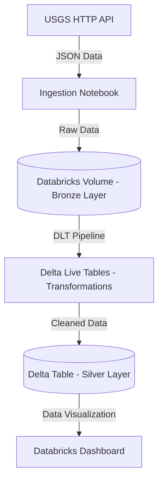

# Real-Time Earthquake Data Engineering Pipeline

This repository contains a comprehensive data engineering pipeline and analytics dashboard for analyzing global earthquake data. The project leverages Databricks Asset Bundles (DAB), Delta Live Tables (DLT), and Databricks SQL Dashboards to ingest, process, and visualize real-time earthquake data from the United States Geological Survey (USGS).

## Architecture Overview

The data pipeline implements a Medallion Architecture (multi-hop data architecture) on the Databricks Data Intelligence Platform to progressively refine data quality.



## Features

- **Medallion Data Architecture**: Structurally separates data into Bronze (raw JSON ingestion in Databricks Volumes) and Silver (cleansed, typed Delta tables), enabling robust data governance and progressive validation.
- **Dynamic Parameterization & Environment Isolation**: Utilizes Databricks Asset Bundles (DAB) variables and notebook widgets (`dbutils.widgets`) for dynamic namespace injection. This allows seamless catalog and schema resolution, ensuring strict isolation between `dev` and `prod` targets.
- **Automated Data Ingestion**: Python-based Databricks notebooks execute parameterized HTTP requests to fetch real-time GeoJSON data from the USGS API.
- **Declarative DLT Pipeline**: Leverages Delta Live Tables to abstract away state management and checkpointing, continuously processing streaming data into structured, query-optimized Delta tables.
- **Infrastructure as Code (IaC)**: CI/CD-ready bundle configuration (`databricks.yml`) for version-controlled deployment of jobs, pipelines, and computational resources.
- **Interactive Dashboards**: Comprehensive visualization of seismic metrics using serverless Databricks SQL Dashboards.

## Technology Stack

- Databricks Data Intelligence Platform
- Delta Live Tables (DLT)
- Apache Spark & Python
- Databricks Asset Bundles (DAB)
- USGS Earthquake API

## Dashboard Overview

The dashboard provides a visual representation of the processed earthquake data, highlighting geographical distribution, magnitude trends, and historical insights.

### Global Earthquake Distribution
The geographical map provides a high-level view of earthquake occurrences worldwide, color-coded and sized based on magnitude and location.
<p align="center">
  
</p>

### Magnitude Analysis
This section analyzes the frequency and severity of earthquakes over time, providing insights into seismic trends and highlighting significant events.
<p align="center">
  
</p>

### Depth and Impact Metrics
Detailed charts depicting the depth of seismic events and their potential impact, which is crucial for understanding the geological mechanics of the affected regions.
<p align="center">
  
</p>

### Regional Summary Statistics
Aggregated statistics for specific regions, allowing for comparative analysis of seismic activity across different fault lines and tectonic plates.
<p align="center">
  
</p>

### Temporal Trends
Time-series visualizations that track the frequency of earthquakes, helping to identify patterns or periods of increased seismic activity.
<p align="center">
  
</p>

### Detailed Event Log
A tabular view of the most recent earthquake events, including precise timestamps, exact coordinates, and detailed magnitude readings.
<p align="center">
  
</p>

## Getting Started

### 1. Prerequisites
- Access to a Databricks Workspace.
- Databricks CLI installed and configured.

### 2. Deployment
Use Databricks Asset Bundles to deploy the pipeline to your workspace.

```bash
cd Earthquake_Analysis_Bundle
databricks bundle deploy -t dev
```

### 3. Running the Pipeline
You can trigger the ingestion notebook and DLT pipeline directly from the Databricks UI under the **Workflows** and **Delta Live Tables** sections, or by running the deployed job.
